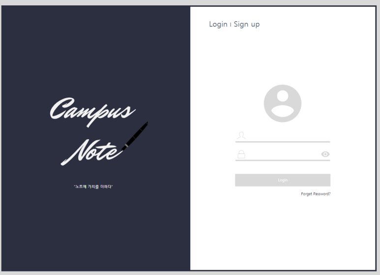
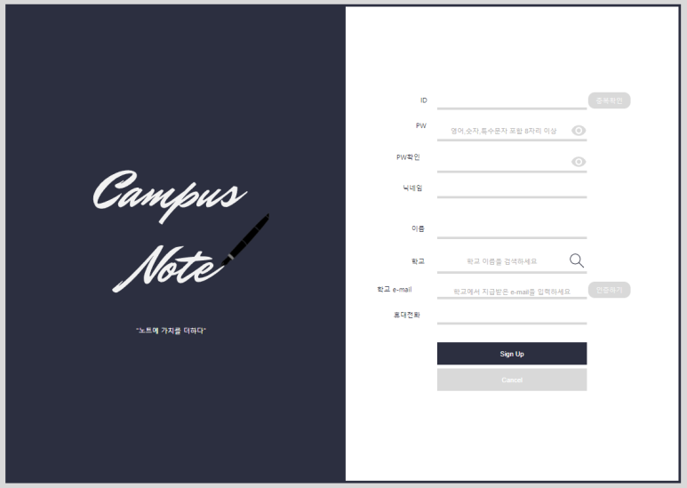
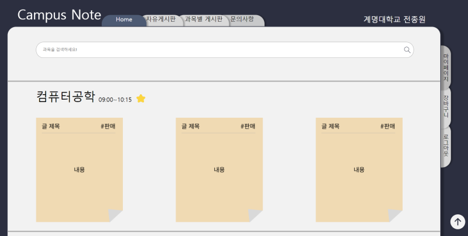
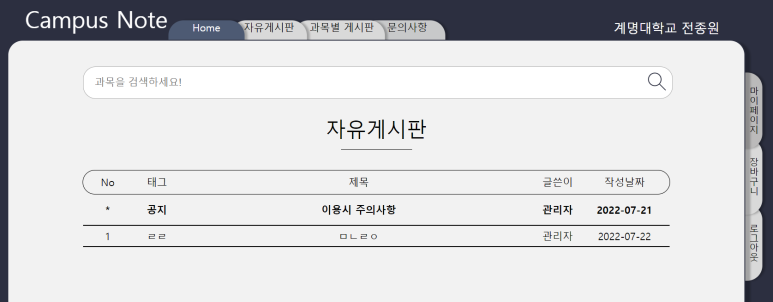
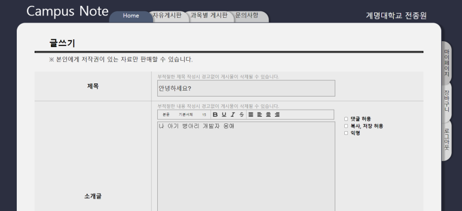
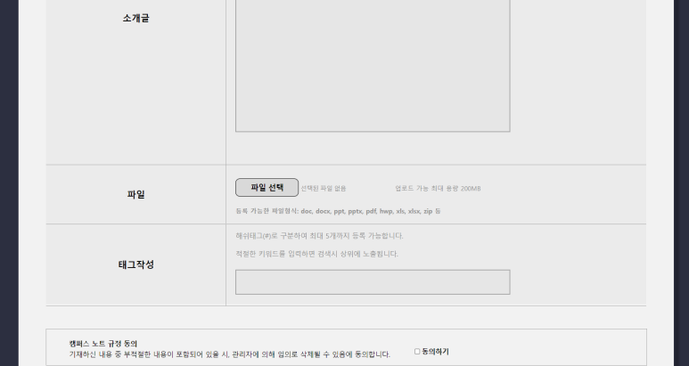
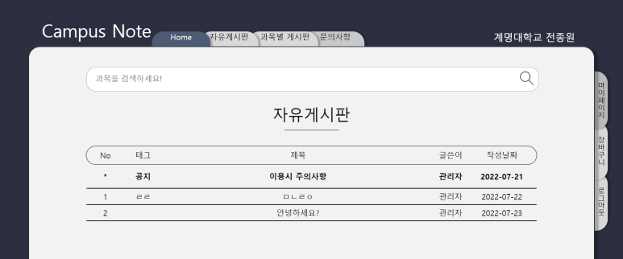
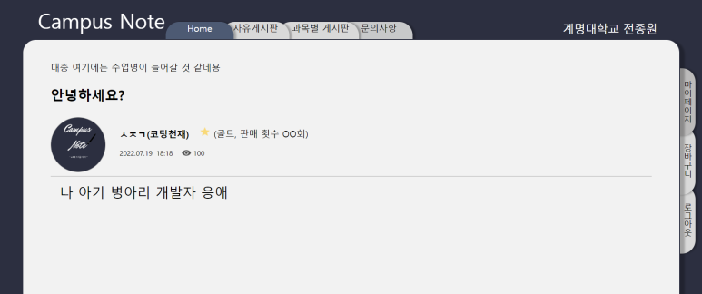
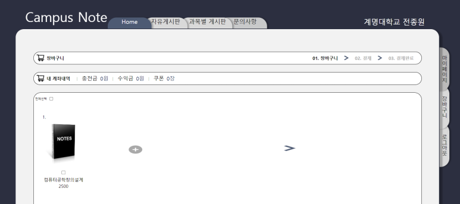

## CampusNote

This project is outcome of the DeaGyeong Hackerton from 7/22 ~ 7/23.

While I was studying data related using Pandas and matplotlib in Python, I realized the importance of data. So, is there any way to make data more valuable in our surroundings? While I was thinking about it, how about building a platform that exchanges the note data I'm writing? This is a project I made with this idea.

## What I do?

- Url routing
- Database CURD
- Login page Design

## Stack

- Django
- Html, Css
- Javascript

## Work Tools

- Figma (Design)
- Notion (Plan)
- Discord (Meeting)

## Pictures

 

 

 

 

 

 

 

 

 

 
